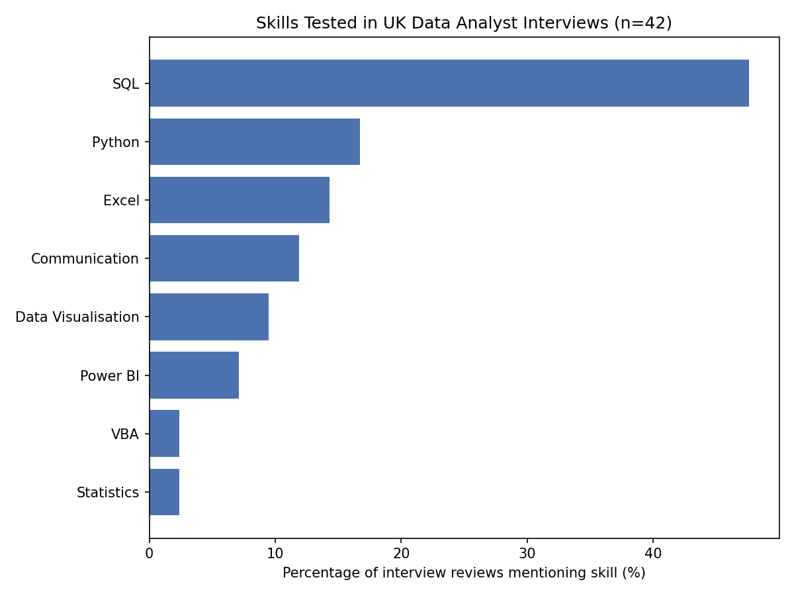
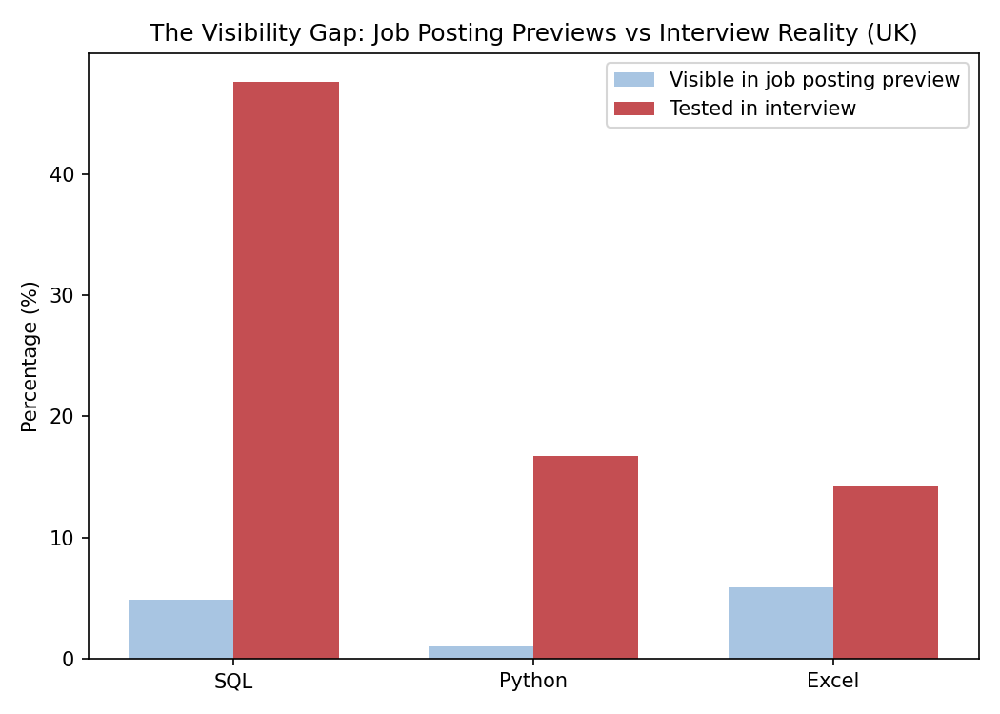
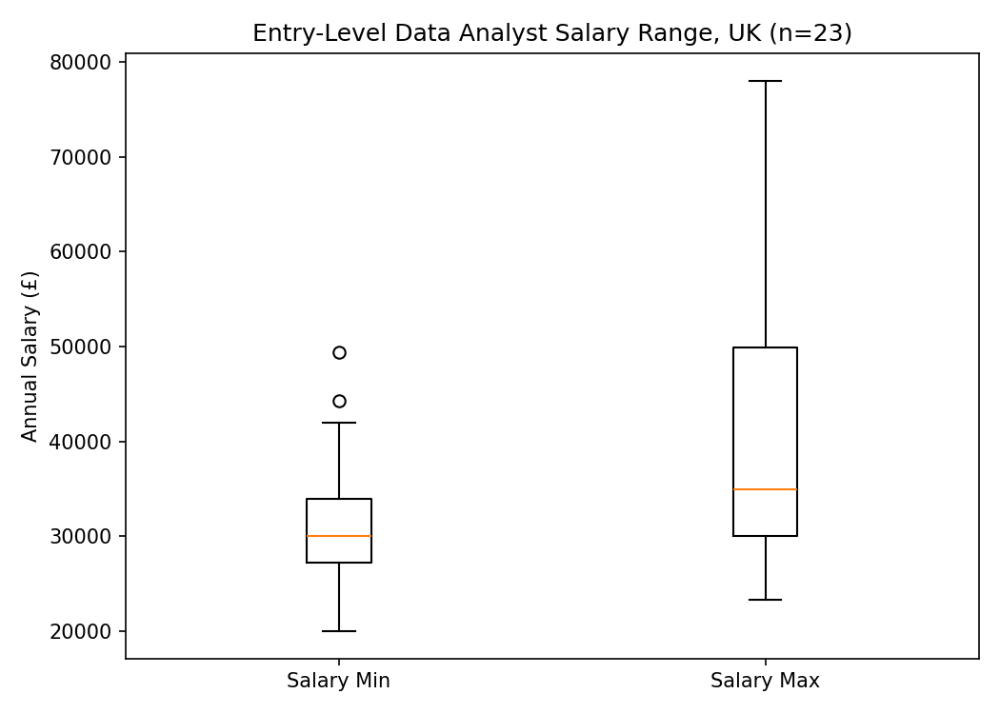
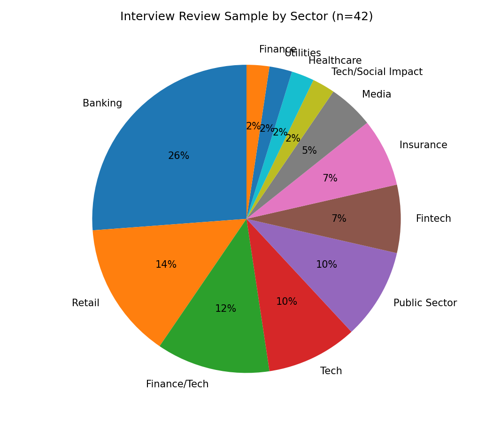

# HireSignal - Decoding What Data Analyst Roles Really Demand

## Overview

HireSignal investigates a question every UK graduate data analyst job-seeker
faces: what do employers actually want, and can you tell from the job
posting alone? This project analyses 287 UK graduate Data Analyst job
postings and 42 real interview experience reviews to uncover the gap
between what's visible to candidates before applying and what's actually
tested during the hiring process.

## Data Sources

**Job Postings (n=287)** - Collected via the Adzuna API, covering UK
graduate/junior/trainee Data Analyst roles. Filtered using a combined
whitelist/blacklist approach to exclude adjacent roles (Finance, HR, Risk,
Payroll) that share keywords but represent different job families.

**Interview Reviews (n=42)** - Manually collected from Glassdoor, covering
27 companies across 11 sectors. Indeed and Reddit's API were both evaluated
as alternative or supplementary sources but were not pursued further -
Indeed presented practical access difficulties during collection, and
Reddit's API returned 403 errors when accessed programmatically (see
Limitations).

## Methodology

### Job Postings Collection & Cleaning

Job postings were collected via the Adzuna API using eight search terms
targeting graduate, junior, and trainee Data Analyst roles in the UK.
Postings were filtered to the most recent ~6 months and cleaned using a
combined keyword approach: a whitelist of Data Analyst-related title terms
(e.g. "data analyst", "insights analyst") combined with a blacklist
excluding adjacent role families that share these terms but represent
different jobs (e.g. "Financial Reporting Analyst", "HR Data Analyst",
"Regulatory Reporting Analyst"). This produced a final dataset of 287
postings.

### Discovery: Job Posting Previews Are Truncated

An initial skill-frequency analysis applied to job posting descriptions
produced implausibly low results (SQL: 4.9%, Python: 1.0%) for a Data
Analyst dataset. Investigation revealed that the Adzuna API returns
descriptions truncated to ~500 characters, and that this truncation
consistently cuts off postings during the company introduction or benefits
section - before the skills/requirements section is reached. Attempting to
retrieve full descriptions via each posting's redirect URL returned a 403
Access Denied response, confirming this as a structural API limitation
rather than a data processing error.

### Pivot: Interview Reviews as the Primary Skills Source

Given this limitation, the 42 manually-collected interview reviews became
the primary source for skill-frequency analysis, as these explicitly
describe what candidates were tested on. The same skill dictionary was
applied to both datasets, allowing a direct comparison between what is
*visible* to candidates in job postings versus what is *tested* in
interviews - reframing the original "job posting vs interview" comparison
around visibility rather than raw frequency.

### Salary Analysis

A separate, independent collection (n=24, reduced to n=23 after removing
one £0 placeholder value) was used to analyse entry-level salary ranges,
filtered to titles containing "graduate", "junior", "trainee", or "entry"
to exclude senior roles that inflated initial salary figures.

## Key Findings

### 1. SQL dominates technical testing - but is barely visible in job postings

SQL appears in 47.6% of interview reviews - by far the most commonly tested
skill, ahead of Python (16.7%) and Excel (14.3%). Yet in job posting
previews, SQL appears in only 4.9% of listings. This is the project's
central finding: **candidates cannot judge the technical bar from the job
posting alone.**

The gap is consistent across all three core skills - Python (1.0% visible
vs 16.7% tested) and Excel (5.9% vs 14.3%) follow the same pattern, though
less dramatically than SQL.

### 2. Entry-level salaries cluster tightly at the lower bound, widely at the upper bound

For UK entry-level Data Analyst roles (n=23), salary minimums are
consistently £28,000-£33,000 (median ~£30,000), with little variation.
Salary maximums, however, range from £30,000 to £50,000+ (one outlier at
£78,000) - suggesting that advertised "potential" salary varies far more
than the realistic starting point.

### 3. The interview review sample spans 11 sectors, with Banking most represented

Banking represents 26% of the interview review sample, followed by Retail
(14%) and Finance/Tech and Tech (12% and 10% respectively). This reflects
genuine UK graduate hiring patterns - banking is consistently among the
largest graduate recruiters - while the sample remains diverse across 27
companies and 11 sectors.

## Limitations

**Job posting descriptions are truncated by the Adzuna API (~500
characters).** This consistently cuts off before the skills/requirements
section, meaning skill-frequency analysis on job postings reflects what
appears in the *preview* - typically salary, location, and benefits -
rather than full requirements. Attempts to retrieve full descriptions via
each posting's redirect URL were blocked (403 Access Denied), confirming
this as a platform-level restriction.

**Interview review sample size (n=42) is modest.** While sufficient to
identify recurring patterns (e.g. SQL's dominance), percentages for
less-common skills (Tableau, R, SAS, etc., all 0% in this sample) should be
read as "not observed in this sample" rather than "never required" -larger
samples may surface these.

**Reddit's API was inaccessible.** Both the official PRAW-based API and the
unauthenticated `.json` endpoint returned 403 errors when accessed from a
Kaggle notebook, reflecting Reddit's 2023+ restrictions on programmatic
access. This eliminated a planned third qualitative data source.

**Interview reviews are self-selected.** Glassdoor reviewers choose to leave
reviews, which may over-represent particularly positive or negative
experiences compared to the full population of candidates.

**Banking is over-represented in the interview sample (26%).** While this
reflects banking's genuine prominence in UK graduate hiring, findings may be
somewhat skewed toward banking-sector interview practices.

**Salary analysis uses a small, independent sample (n=23).** This was
collected separately from the main 287-posting dataset and filtered to
entry-level titles, but remains a small sample for salary benchmarking.

**Date ranges differ slightly between datasets.** The 287 job postings
reflect a snapshot taken during the collection period; interview reviews
span a wider historical range as review recency was not strictly filtered,
since interview *process structures* change more slowly than specific
*skill demands*.

## Future Work

**Extend the analysis to other graduate roles.** This project focused
specifically on Data Analyst roles. A natural extension would be testing
whether the "visibility gap" identified here - where job posting previews
under-represent what's actually tested in interviews - also exists for
other graduate role types (e.g. Software Engineer, Marketing Analyst,
Business Analyst). This would clarify whether the finding reflects a
Data-Analyst-specific pattern or a broader feature of UK graduate hiring.

**Access full job descriptions through an alternative source.** The Adzuna
truncation issue could be addressed by using a job board with an open
full-description API, or by partnering with a service that provides
complete listings, enabling a true posting-vs-interview skill comparison.

**Expand the interview review sample.** Continued manual collection from
Glassdoor - or revisiting Indeed and Reddit once access issues are resolved
- would increase the sample size and surface skills not yet observed (e.g.
Tableau, R, cloud platforms).

**Re-balance sector representation.** Targeted collection from
under-represented sectors (Healthcare, Utilities, Media) would reduce the
current Banking concentration and improve generalisability.

**Track changes over time.** Re-running this analysis quarterly would show
whether the visibility gap (job postings vs interview reality) narrows or
widens, and whether salary ranges shift with the broader UK job market.

**Expand geographically.** Comparing UK findings against other European
markets would test whether the visibility gap is a UK-specific pattern or a
broader phenomenon in graduate hiring.

---

Prepared by Sydney Ndabai · MSc Data Analytics · Graduate job market target

